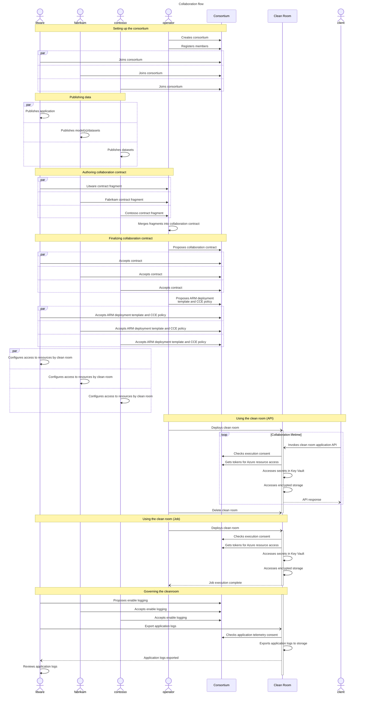
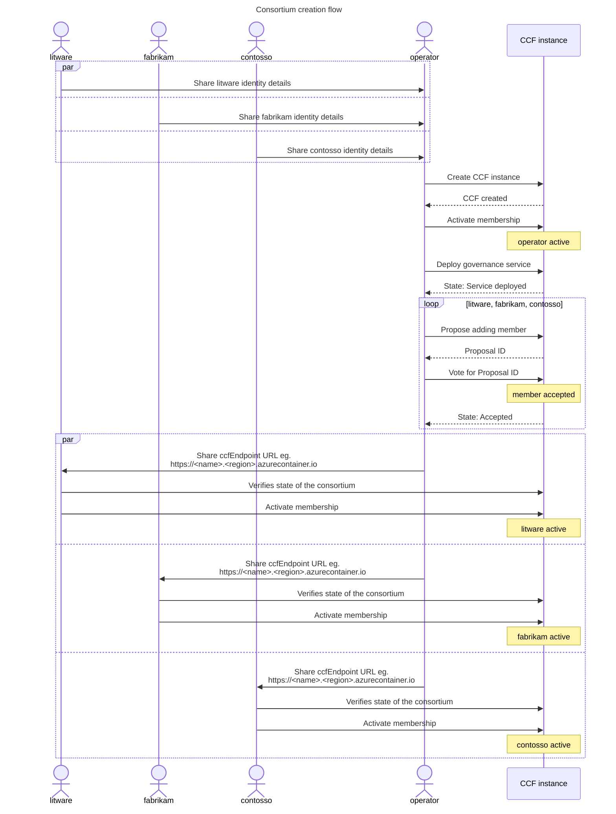
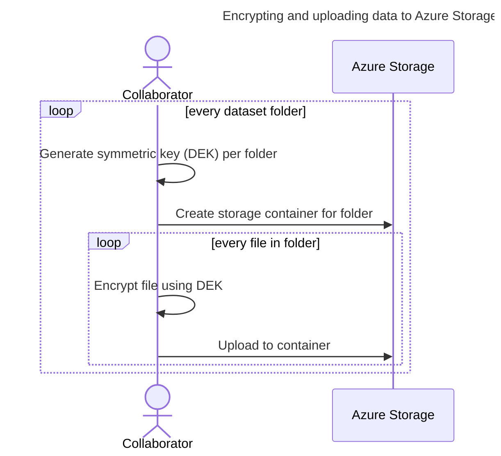
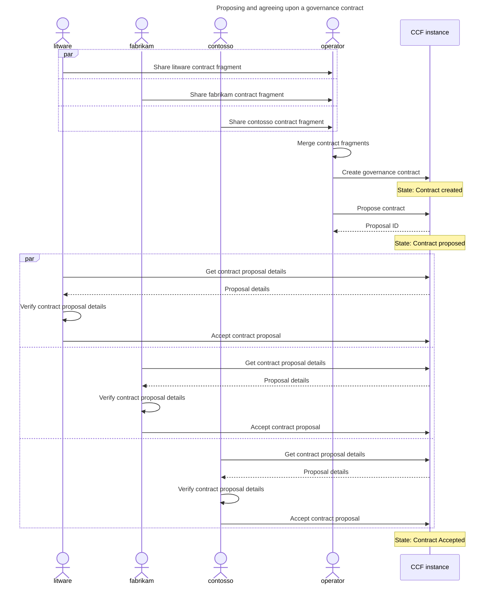
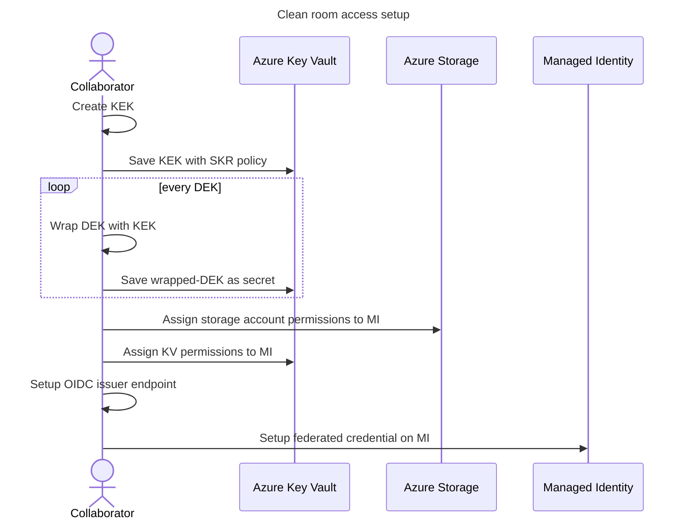

# Azure Clean Room Samples <!-- omit from toc -->

This repository demonstrates usage of an [Azure **_Confidential Clean Room_** (**CCR**)](https://github.com/Azure/azure-cleanroom) for multi-party collaboration.

# Table of Contents <!-- omit from toc -->
<!--
  DO NOT UPDATE THIS MANUALLY

  The TOC is managed using the "Markdown All in One" extension.
  Use the extension commands to auto-update the TOC and section numbers.
-->
- [Overview](#overview)
- [Samples environment (per collaborator)](#samples-environment-per-collaborator)
  - [Bringing up the environment](#bringing-up-the-environment)
  - [Initializing the environment](#initializing-the-environment)
- [High level execution sequence](#high-level-execution-sequence)
- [Setting up the consortium](#setting-up-the-consortium)
  - [Member identity creation (operator, litware, fabrikam, contosso)](#member-identity-creation-operator-litware-fabrikam-contosso)
  - [Create the CCF instance (operator)](#create-the-ccf-instance-operator)
  - [Invite members to the consortium (operator)](#invite-members-to-the-consortium-operator)
  - [Join the consortium (litware, fabrikam, contosso)](#join-the-consortium-litware-fabrikam-contosso)
- [Publishing data](#publishing-data)
  - [KEK-DEK based encryption approach](#kek-dek-based-encryption-approach)
  - [Encrypt and upload data (fabrikam, contosso)](#encrypt-and-upload-data-fabrikam-contosso)
- [Authoring collaboration contract](#authoring-collaboration-contract)
  - [Initializing a contract fragment (litware, fabrikam, contosso)](#initializing-a-contract-fragment-litware-fabrikam-contosso)
  - [Adding data sets to the contract (fabrikam, contosso)](#adding-data-sets-to-the-contract-fabrikam-contosso)
  - [Adding application to the contract (litware)](#adding-application-to-the-contract-litware)
  - [Setting up log collection (litware)](#setting-up-log-collection-litware)
- [Finalizing collaboration contract](#finalizing-collaboration-contract)
  - [Proposing a governance contract (operator)](#proposing-a-governance-contract-operator)
  - [Agreeing upon the contract (litware, fabrikam, contosso, operator)](#agreeing-upon-the-contract-litware-fabrikam-contosso-operator)
  - [Propose ARM template, CCE policy and log collection (operator)](#propose-arm-template-cce-policy-and-log-collection-operator)
  - [Accept ARM template, CCE policy and logging proposals (litware, fabrikam, contosso, operator)](#accept-arm-template-cce-policy-and-logging-proposals-litware-fabrikam-contosso-operator)
  - [Configure resource access for clean room (litware, fabrikam, contosso)](#configure-resource-access-for-clean-room-litware-fabrikam-contosso)
- [Using the clean room](#using-the-clean-room)
  - [Deploy clean room (operator)](#deploy-clean-room-operator)
  - [View output (fabrikam, contosso, client)](#view-output-fabrikam-contosso-client)
- [Governing the cleanroom](#governing-the-cleanroom)
  - [Viewing telemetry (litware)](#viewing-telemetry-litware)
  - [Viewing audit events (operator, litware, fabrikam, contosso)](#viewing-audit-events-operator-litware-fabrikam-contosso)
- [Contributing](#contributing)
- [Trademarks](#trademarks)

# Overview

<!--TODO: Add links to corresponding readme in product repo for each capability.-->
The following aspects of collaboration using clean room infrastructure are demonstrated:
- Collaboration
    - Publishing sensitive data such that it can only be consumed within a clean room. (_Data Source_)
    - Producing sensitive data from within the clean room such that it can only be read by the intended party. (_Data Sink_)
    - Configuring an application to consume and generate sensitive data within a clean room. (_Data Access_)
    - Configuring HTTPS endpoints for clients to invoke the application. (_API Endpoint_)
    - Configuring network policy to govern traffic allowed on the application endpoint. (_Network Protection_)
- Governance
    - Authoring and finalizing a governance contract capturing the application to be executed in the clean room and the data to be made available to it. (_Contract_)
    - Agreeing upon ARM templates and confidential computation security policies that will be used for deploying a clean room implementing the contract. (_Deployment_)
    - Authoring and finalizing governed documents queried by clean room applications at runtime. (_Document Store_)
    - Enabling collection of application logs and clean room infrastructure telemetry, and inspecting the same in a confidential manner. (_Telemetry_)
    - Auditing clean room execution. (_Audit_)
    - Configuring federation for clean room identity in a confidential manner. (_Identity Provider_)
    - Setting up a confidential certificate authority for an HTTPS endpoint inside the clean room. (_CA_)

Quick start demos showcasing basic functionality:
- Confidential access of protected data through a job. [`cleanroomhello-job`](./demos/cleanroomhello-job/README.md)
- Confidential access of protected data through an API endpoint. [`cleanroomhello-api`](./demos/cleanroomhello-api/README.md)

End to end demos showcasing scenario oriented usage:
- Confidential execution of audited queries on protected datasets using a standalone DB engine residing within the CCR. [`analytics`](./demos/analytics/README.md)
- Confidential inference from sensitive data using a protected ML model. [`inference`](./demos/inference/README.md)
<!-- TODO: Add fine tuning sample.
- Confidential fine tuning of a protected ML model on protected datasets. [Training]
tuning [Job]
    litware - training app in, logs and telemetry out
    fabrikam - initial-model in, tuned-model out
    contosso - dataset in, nothing out
    consumer - NA
-->

|                     | `cleanroomhello-job`  | `cleanroomhello-api`  | `analytics`         | `inference`         |
| :---                | :---:                 | :---:                 | :---:               | :---:               |
| _**Collaboration**_ |                       |                       |                     |                     |
| Data Source         | :heavy_check_mark:    | :x:                   | :heavy_check_mark:  | :heavy_check_mark:  |
| Data Sink           | :heavy_check_mark:    | :x:                   | :x:                 | :x:                 |
| Data Access         | :heavy_check_mark:    | :x:                   | :heavy_check_mark:  | :heavy_check_mark:  |
| API Endpoint        | :x:                   | :heavy_check_mark:    | :heavy_check_mark:  | :heavy_check_mark:  |
| Network Protection  | :x:                   | :heavy_check_mark:    | :x:                 | :x:                 |
| _**Governance**_    |                       |                       |                     |                     |
| Contract            | :heavy_check_mark:    | :heavy_check_mark:    | :heavy_check_mark:  | :heavy_check_mark:  |
| Deployment          | :heavy_check_mark:    | :heavy_check_mark:    | :heavy_check_mark:  | :heavy_check_mark:  |
| Document Store      | :x:                   | :x:                   | :heavy_check_mark:  | :x:                 |
| Telemetry           | :heavy_check_mark:    | :x:                   | :x:                 | :x:                 |
| Audit               | :heavy_check_mark:    | :heavy_check_mark:    | :heavy_check_mark:  | :heavy_check_mark:  |
| Identity Provider   | :heavy_check_mark:    | :x:                   | :heavy_check_mark:  | :heavy_check_mark:  |
| CA                  | :x:                   | :heavy_check_mark:    | :heavy_check_mark:  | :heavy_check_mark:  |

<br>

All the demos demonstrate collaborations where one or more of the following parties come together:
  - **_Litware_**, end to end solution developer publishing applications that execute within the CCR.
  - **_Fabrikam_**, collaborator owning sensitive dataset(s) and protected AI model(s) that can be consumed by applications inside a CCR.
  - **_Contosso_**, collaborator owning sensitive dataset(s) that can be consumed by applications inside a CCR.

The following parties are additionally involved in completing the end to end demo:
  - **_Operator_**, clean room provider hosting the CCR infrastructure.
  - **_Client_**, consumer invoking the CCR endpoint to gather insights, without any access to the protected data itself.

In all cases, a CCR will be executed to run the application while protecting the privacy of all ingested data, as well as protecting any confidential output. The CCR instance can be deployed by the **_operator_**, any of the collaborators or even the **_client_** without any impact on the zero-trust promise architecture.

# Samples environment (per collaborator)
All the involved parties need to bring up a local environment to participate in the sample collaborations.

## Bringing up the environment
> [!NOTE]
> Prerequisites to bring up the environment
> * Docker installed locally. Installation instructions [here](https://docs.docker.com/engine/install/).
> * PowerShell installed locally. Installation instructions [here](https://learn.microsoft.com/en-us/powershell/scripting/install/installing-powershell).
>
> You can also use GitHub Codespaces to create the local environment which would have the above prerequisites pre-installed.

Each party requires an independent environment. To create such an environment, open a separate powershell window for each party and run the following commands:


```powershell
$persona = # Set to one of: "operator" "litware" "fabrikam" "contosso" "client"
```
<!-- TODO: Is it worthwhile adding a selector instead?
```powershell
function Choose-Option([string[]] $options, [string] $prompt) { 
  $displayString = "" 
  for ($i = 0; $i -lt $options.Length; $i++)
  {
    $displayString += "${i}: $($options[$i])$([environment]::NewLine)"
  } 
  $displayString += "Choose $prompt" 
  $choice=Read-Host $displayString 
  return $options[([convert]::ToInt32($choice))] 
} `
$persona = (Choose-Option -options @('operator','litware','fabrikam','contosso','client') -prompt 'persona')
```
-->

```powershell
./start-environment.ps1 -shareCredentials -persona $persona
```

This create a separate docker container for each party that contains an isolated enviroment, while sharing some host volumes across all of them to simplify sharing 'public' configuration details across parties.

> [!IMPORTANT]
> The command configures the environment to use a randomly generated resource group name on every invocation. To control the name, or to reuse an existing resource group, pass it in using the `-resourceGroup` parameter.


> [!TIP]
> The`-shareCredentials` switch above enables the experience for sharing Azure credentials across the sample environments of all the parties. This brings up a credential proxy container `azure-cleanroom-samples-credential-proxy` that performs a single interactive logon at the outset, and serves access tokens to the rest of the containers from here onwards.

## Initializing the environment
> [!NOTE]
> Prerequisites to initialize the environment
> * An Azure subscription with adequate permissions to create resources and manage permissions on these resources.

Once the environment is up, execute the following command to logon to Azure:

```powershell
az login --identity
```

The command shows the subscription that will be used for resource creation by the sample scripts.

> [!TIP]
> - The command defaults to using shared credentials for logon. To use a different set of credentials for, omit the `--identity` switch and follow the device login prompts.
> - If another subscription is to be used for creating resources, execute `az account set` to select if before executing the remaining steps.


Post login, initialize the enviroment for executing the samples by executing the following command from the `/home/samples` directory:

```powershell
./scripts/initialize-environment.ps1
```

This command create the resource group and other Azure resources required for executing the samples such as a storage account, container registry and key vault (Premium).

> [!NOTE]
> All the steps henceforth assume that you are working in the `/home/samples` directory of the docker container, and commands are provided relative to that path.

<br>
<details><summary><em>Further details</em></summary>
<br>

The following Azure resources are created as part of initialization:
 - Key Vault (Premium) for `litware`, `fabrikam` and `contosso` environments to store data encryption keys.
 - Storage Account for `litware`, `fabrikam` and `contosso` environments to use as a backing store for clean room input and output.
 - Storage Account with public blob access enabled for `litware`, `fabrikam` and `contosso` environments to store federated identity token issuer details.
 - Storage Account with shared key access enabled for `operator` environment to use as a backing store for CCF deployments.
 - Container Registry with anonymous pull enabled for `litware` environment to use as a backing store for clean room applications and network policies.
</details>
<br>

# High level execution sequence
The sequence diagram below captures the overall flow of execution that happens across the samples being demonstrated. It might be helpful to keep this high level perspective in mind as you run through the steps.

<br>

<!-- TODO: Update block diagram to be more generic. -->
<!-- Once the clean room is deployed the key components involved during execution are shown below:
 -->

# Setting up the consortium
Collaboration using a CCR is realized and governed through a consortium created using [CCF](https://microsoft.github.io/CCF/main/overview/what_is_ccf.html) hosting a [Clean Room Governance Service (CGS)](https://github.com/Azure/azure-cleanroom/tree/main/src/governance). All the collaborating parties become participating members in the consortium.

From a confidentiality perspective any of the collaborators or the *operator* can create the CCF instance without affecting the zero-trust assurances. In these samples, we assume that it was agreed upon that the *operator* will host the CCF instance. The *operator* would create the CCF instance and then invite all the collaborators as members into the consortium.



## Member identity creation (operator, litware, fabrikam, contosso)
A CCF member is identified by a public-key certificate used for client authentication and command signing.

Each member of the collaboration creates their member identity by generating their public and private key pair by executing the following command:

```powershell
./scripts/consortium/initialize-member.ps1
```

This shares the certificate (e.g. `contosso_cert.pem`) and Azure AD tenant ID with the `operator`. This information is used in subsequent steps to register members with the consortium.

> [!IMPORTANT]
> The member’s identity private key generated by the command (e.g. `contosso_privk.pem`) should not be shared with any other member.
> It should be stored on a trusted device (e.g. HSM) and kept private at all times.

<br>
<details><summary><em>Azure CLI commands used</em></summary>
<br>

- `az cleanroom governance member keygenerator-sh` - generate consortium member certificate and keys.
</details>
<br>

## Create the CCF instance (operator)

The _operator_ (who is hosting the CCF instance) brings up a CCF instance using Confidential ACI by executing this command:

```powershell
./scripts/consortium/start-consortium.ps1
```

> [!NOTE]
> In the default sample environment, the containers for all participants have their `/home/samples/demo-resources/public` mapped to a single host directory, so details about the CCF endpoint would be available to all parties automatically once generated. If the configuration has been changed, the CCF details needs to made available in `/home/samples/demo-resources/public` of each member before executing subsequent steps.

<br>
<details><summary><em>Azure CLI commands used</em></summary>
<br>

- `az cleanroom governance member keygenerator-sh` - generate CCF network operator certificate and keys.
- `az cleanroom ccf network create` - initialize a CCF network using `caci` (Confidential ACI) infrastructure.
- `az cleanroom ccf network transition-to-open` - activate the CCF network.
- `az cleanroom ccf provider configure` - deploy a local container hosting a client for interacting with the CCF network infrastructure.
- `az cleanroom governance client deploy` - deploy a local container hosting a client for interacting with the consortium.
</details>
<br>

## Invite members to the consortium (operator)
The _operator_ (who is hosting the CCF instance) registers each member of the collaboration with the consortium using the identity details generated [above](#member-identity-creation-operator-litware-fabrikam-contosso).


```powershell
./scripts/consortium/register-member.ps1
```

> [!NOTE]
> In the default sample environment, the containers for all participants have their `/home/samples/demo-resources/public` mapped to a single host directory, so this identity information would be available to all parties automatically once generated. If the configuration has been changed, the identity details of all other parties needs to made available in `/home/samples/demo-resources/public` of the _operator's_ environment before running the registration command above.

> [!TIP]
> To add a member to the consortium, one of the existing members is required to create a proposal for addition of the member, and a quorum of members are required to accept the same.
>
> In the default sample flows, the _operator_ is the **only** active member of the consortium at the time of inviting the members, allowing a simplified flow where the _operator_ can propose and accept all the collaborators up front. Any additional/out of band member registrations at a later time would require all the **active** members at that point to accept the new member.

<br>
<details><summary><em>Azure CLI commands used</em></summary>
<br>

- `az cleanroom governance member add` - generate CCF proposal to add a member to the consortium.
- `az cleanroom governance proposal vote` - accept/reject a CCF proposal.
</details>
<br>

## Join the consortium (litware, fabrikam, contosso)
Once the collaborators have been added, they now need to activate their membership before they can participate in the collaboration.

```powershell
./scripts/consortium/confirm-member.ps1
```

With the above steps the consortium creation that drives the creation and execution of the clean room is complete. We now proceed to preparing the datasets and making them available in the clean room.

> [!TIP]
> The same consortium can be used/reused for executing any/all the sample demos. There is no need to repeat these steps unless the collaborators have changed.

> [!NOTE]
> In the default sample environment, the containers for all participants have their `/home/samples/demo-resources/public` mapped to a single host directory, so details about the CCF endpoint would be available to all parties automatically once generated by the _operator_. If the configuration has been changed, the CCF details needs to made available in `/home/samples/demo-resources/public` of each member before executing subsequent steps.

<br>
<details><summary><em>Azure CLI commands used</em></summary>
<br>

- `az cleanroom governance member activate` - accept an invitation to join the consortium.
</details>
<br>

# Publishing data
Sensitive data that any of the parties want to bring into the collaboration needs to be encrypted in a manner that ensures the key to decrypt this data will only be released to the clean room environment.

## KEK-DEK based encryption approach
The samples follow an envelope encryption model for encryption of data. For the encryption of the data, a symmetric **_Data Encryption Key_** (**DEK**) is generated. An asymmetric key, called the *Key Encryption Key* (KEK), is generated subsequently to wrap the DEK. The wrapped DEKs are stored in a Key Vault as a secret and the KEK is imported into an MHSM/Premium Key Vault behind a secure key release (SKR) policy. Within the clean room, the wrapped DEK is read from the Key Vault and the KEK is retrieved from the MHSM/Premium Key Vault following the secure key release [protocol](https://learn.microsoft.com/en-us/azure/confidential-computing/skr-flow-confidential-containers-azure-container-instance). The DEKs are unwrapped within the cleanroom and then used to access the storage containers.

## Encrypt and upload data (fabrikam, contosso)
It is assumed that the collaborators have had out-of-band communication and have agreed on the data sets that will be shared. In these samples, the protected data is in the form of one or more files in one or more directories at each collaborators end.

These dataset(s) in the form of files are encrypted using the [KEK-DEK](#kek-dek-based-encryption-approach) approach and uploaded into the storage account created as part of [initializing the sample environment](#initializing-the-environment). Each directory in the source dataset would correspond to one Azure Blob storage container, and all files in the directory are uploaded as blobs to Azure Storage using specified encryption mode - client-side encryption <!-- TODO: Add link to explanation of CSE. -->/ server-side encryption using [customer provided key](https://learn.microsoft.com/azure/storage/blobs/encryption-customer-provided-keys). Only one symmetric key (DEK) is created per directory (blob storage container).



> [!TIP]
> Set a variable `$demo` to the name of the demo to be executed (_e.g., "**cleanroomhello-job**"_) - it is a required input for subsequent steps.
> ```powershell
> $demo = # Set to one of: "cleanroomhello-job", "cleanroomhello-api", "analytics", "inference"
> ```

The following command initializes datastores and uploads encrypted datasets required for executing the samples:

```powershell
./scripts/data/publish-data.ps1 -demo $demo
```

> [!NOTE]
> This command seeds the environment with data from external sources in some of the samples. As a result, this step which could take some time.

<!-- TODO: Switch data sources and data sinks to CSE and drop this note.-->
> [!NOTE]
> The samples currently use server-side encryption for all data sets. However the clean room infrastructure supports client side encryption as well, and client side encryption is the recommended encryption mode as it offers a higher level of confidentiality.

<br>
<details><summary><em>Azure CLI commands used</em></summary>
<br>

- `az cleanroom datastore add` - initialize a data store. The `--encryption-mode` parameter specifies the encryption mode - `CPK` (server side encryption) or `CSE` (client side encryption).
- `az cleanroom datastore upload` - encrypt and upload local data to a data store.
</details>
<br>


# Authoring collaboration contract

Every party participating in the collaboration authors their respective contract fragment independently. In these samples, the collaborators share their respective fragments with the _operator_ who merges them into a collaboration contract.

## Initializing a contract fragment (litware, fabrikam, contosso)

The following command initializes the contract fragement for a given demo:

```powershell
./scripts/specification/initialize-specification.ps1 -demo $demo
```

In addition to the contract fragment, this command creates a managed identity that will be used by the clean room to access Azure resources.

<br>
<details><summary><em>Azure CLI commands used</em></summary>
<br>

- `az cleanroom config init` - initialize a clean room specification representing the contract fragment.
- `az identity create` - create a managed identity used by the clean room to access Azure resources.
</details>
<br>


## Adding data sets to the contract (fabrikam, contosso)

The following command adds details about the datastores to be accessed by the clean room and their mode (source/sink) to the contract fragment:


```powershell
./scripts/specification/add-specification-data.ps1 -demo $demo
```

> [!TIP]
> <a name="MountPoints"></a>
> During clean room execution, the datasources and datasinks get presented to the application as file system mount points using the [Azure Storage Blosefuse](https://github.com/Azure/azure-storage-fuse/tree/main?tab=readme-ov-file#about) driver.
>
> The application reads/writes data from/to these mountpoint(s) in clear text. Under the hood, the storage system is configured to handle all the cryptography semantics, and transparently decrypts/encrypt the data using the [DEK](#61-kek-dek-based-encryption-approach) corresponding to each datastore.

<br>
<details><summary><em>Azure CLI commands used</em></summary>
<br>

- `az cleanroom config add-datasource` - configure a data source for reading data in the clean room.
- `az cleanroom config add-datasink` - configure a data sink for writing data from the clean room.
</details>
<br>

## Adding application to the contract (litware)

The following command adds details about the (containerized) application to be executed within the clean room to the contract fragment:


```powershell
pwsh ./demos/$demo/add-specification-application.ps1
```

> [!NOTE]
> For some samples, this command builds and publishes the application to an Azure Container Registry. This could take a long time to complete if the build process has to pull a large number of underlying layers to generate the container image.


The application container is configured to access protected data through the corresponding filesystem [mount point](#MountPoints) for the datasource/datasink. The fragment also include details about the container image to be executed such as the container registry, image ID, command, environment variables and requested resources.

> [!WARNING]
> The resources for the application container should be allocated so as not to violate confidential ACI limits as defined [here](https://learn.microsoft.com/en-us/azure/container-instances/container-instances-resource-and-quota-limits#confidential-container-resources-preview).

> [!TIP]
> The set of datasource/datasink mount points available to an application is controlled through the `--datasinks/--datasources` options of the `az cleanroom config add-application` command. These take an input of a list, where each value is specified as the following two-tuple of key-value pairs (comma separated):
> - `foo`, where `foo` is the name the datasource/datasink to be accessed.
> - `bar`, where `bar` is the path at which the datasource/datasink is to mounted within the application container.
>
> *E.g.*,`--datasources "fabrikam-input=/mnt/remote/model" "contosso-input/mnt/remote/dataset"` `--datasinks "fabrikam-output=/mnt/remote/output`

> [!TIP]
> To enable traffic to/from the application, the `az cleanroom config network http enable` is used. This takes the direction of traffic as an input which can be specified as `--direction [inbound/outbound]` along with an optional policy URL to enforce for requests.

<br>
<details><summary><em>Azure CLI commands used</em></summary>
<br>

- `az cleanroom config add-application` - configure the application to be executed within the clean room.
- `az cleanroom config network http enable` - allow traffic to/from the application executing within the clean room.
</details>
<br>

## Setting up log collection (litware)

The following command adds details about the storage account endpoint details for collecting the application logs:

```powershell
./scripts/specification/add-specification-telemetry.ps1 -demo $demo
```

The actual download of the logs happens later on in the flow.

> [!TIP]
> In these samples, _litware_ provisions the storage resources to be used by the clean room for exporting any telemetry and logs from the clean room during/after execution, and _fabrikam_ and _contosso_ accept the same.
>
> If any party, say _fabrikam_ were to have a concern that sensitive information might leak out via logs and hence need to inspect the log files before the other party gets them, then the telemetry configuration can be achieved by _fabrikam_ using a storage account under their control as the destination for the execution logs. The log files would then be encrypted and written out to Azure storage with a key that is in _fabrikam's_ control, who can then download and decrypt these logs, inspect them and only share them with _litware_ if satisfied.

<br>
<details><summary><em>Azure CLI commands used</em></summary>
<br>

- `az cleanroom config set-logging` - configure a data sink for exporting application telemetry (if enabled).
- `az cleanroom config set-telemetry` - configure a data sink for exporting infrastructure telemetry (if enabled).
</details>
<br>

# Finalizing collaboration contract

Once the collaborating parties are finished with above steps, the generated contract fragment for each party captures various details that all parties need to exchange and agree upon before the clean room can be created and deployed. This exchange and agreement is captured formally by creation of a **_governance contract_** hosted in the consortium. This is a YAML document that is generated by consuming all the contract fragments and captures the collaboration details in a formal [*clean room specification*](../../docs/cleanroomspec.md).

From a confidentiality perspective, the contract creation and proposal can be initiated by any of the collaborators or the *operator* without affecting the zero-trust assurances. In these samples, we assume that it was agreed upon that the *operator* undertakes this responsibility.



## Proposing a governance contract (operator)

The _operator_ merges all the contract fragments shared by the collaborators and proposes the resultant clean room specification yaml as the final contract.


```powershell
./scripts/contract/register-contract.ps1 -demo $demo
```

> [!TIP]
> Set a variable `$contractId` to the contract ID generated above (_e.g., "**collab-cleanroomhello-job-8a106fb6**"_) - it is a required input for subsequent steps.
> ```powershell
> $contractId = # generated contractId # E.g. "collab-cleanroomhello-job-8a106fb6"
> ```

> [!WARNING]
> In the default sample environment, the containers for all participants have their `/home/samples/demo-resources/public` mapped to a single host directory, so the contract fragments would be available to all parties automatically once generated. If the configuration has been changed, the fragments of all other parties needs to made available in `/home/samples/demo-resources/public` of the _operator's_ environment before running the command above.

<br>
<details><summary><em>Azure CLI commands used</em></summary>
<br>

- `az cleanroom config view` - merge multiple contract fragments into a single clean room specification.
- `az cleanroom governance contract create` - initialize a collaboration contract.
- `az cleanroom governance contract propose` - propose a collaboration contract to the consortium.
</details>
<br>


## Agreeing upon the contract (litware, fabrikam, contosso, operator)
<!--TODO: Get rid of the operator agreeing upon the contract.-->
The collaborating parties can now query the governance service to get the proposed contract, run their validations and accept or reject the contract.

<!--TODO: Add query to figure out the contract ID by hitting CGS.-->
```powershell
./scripts/contract/confirm-contract.ps1 -contractId $contractId -demo $demo
```

> [!NOTE]
> After confirming the contract, the command may propose additional documents to the consortium to be associated with the contract in some demos. If accepted, these documents are presented to the application by the clean room infrastructure at runtime, and their contents are governed through the consortium.

> [!TIP]
> While the sample scripts are registering and accepting these documents as part of finalizing the collaboration contract, these steps can be performed at a later point as well, including after clean room deployment as the clean room infrastructure always queries the consortium for the documents at runtime.

<br>
<details><summary><em>Azure CLI commands used</em></summary>
<br>

- `az cleanroom governance contract vote` - accept / reject a collaboration contract.
- `az cleanroom governance document create` - initialize a collaboration document.
- `az cleanroom governance document propose` - propose a collaboration document to the consortium.
</details>
<br>

## Propose ARM template, CCE policy and log collection (operator)
Once the contract is accepted by all the collaborators, the _operator_ generates the artefacts required for deploying a _*CCR*_ instance for the contained clean room specification using Azure Confidential Container Instances ([_C-ACI_](https://learn.microsoft.com/azure/container-instances/container-instances-confidential-overview)) and proposes them to the consortium.

```powershell
./scripts/contract/register-deployment-artefacts.ps1 -contractId $contractId
```

Two artefacts are required to [deploy](https://learn.microsoft.com/azure/container-instances/container-instances-tutorial-deploy-confidential-containers-cce-arm) C-ACI containers - the C-ACI ARM deployment template, and the Confidential Computing Enforcement Policy ([_CCE policy_](https://learn.microsoft.com/en-us/azure/container-instances/container-instances-confidential-overview#confidential-computing-enforcement-policies)) computed for this template.

The command generates these artefacts and proposes them to the governance service - the **_deployment_** proposal contains the ARM template (`cleanroom-arm-template.json`) which can be deployed for instantiating the clean room, and the **_policy_** proposal contains the clean room policy (`cleanroom-governance-policy.json`)  which identifies this clean room when it is executing

In addition to this, the command submits an **_enable CA_** proposal to provision a CA cert for HTTPS calls that uniquely identifies this clean room when it is executing, as well as proposals for enabling log collection.

> [!TIP]
> The samples take advantage of pre-calculated CCE policy fragments when computing the clean room policy. If desired, the policy can be computed afresh by setting the `securityPolicy` parameter to `generate` or `generate-debug`. Note that the command will take longer in this case as it invokes `az confcom acipolicygen` internally which takes 10-15 minutes to finish.

<br>
<details><summary><em>Azure CLI commands used</em></summary>
<br>

- `az cleanroom governance deployment generate` - generate deployment template and CCE policy.
- `az cleanroom governance deployment template propose` - propose deployment template to consortium.
- `az cleanroom governance deployment policy propose` - propose CCE policy to the consortium.
- `az cleanroom governance ca propose-enable` - propose enabling root CA functionality to the consortium.
- `az cleanroom governance contract runtime-option propose --option logging` - propose enabling export of application telemetry.
- `az cleanroom governance contract runtime-option propose --option telemetry` - propose enabling export of infrastructure telemetry.
</details>
<br>


## Accept ARM template, CCE policy and logging proposals (litware, fabrikam, contosso, operator)
<!--TODO: Get rid of the operator agreeing upon the contract.-->

Once the *ARM template* and *CCE policy* proposals are available in the consortium, the collaborating parties validate and vote on these proposals. In these samples, we accept these proposals without any verification.


```powershell
./scripts/contract/confirm-deployment-artefacts.ps1 -contractId $contractId
```

Where applicable, any documents proposed to be associated with this contract are also accepted as part of this command.

<br>
<details><summary><em>Azure CLI commands used</em></summary>
<br>

- `az cleanroom governance deployment template show` - show deployment template proposal.
- `az cleanroom governance deployment policy show` - show CCE policy proposal.
- `az cleanroom governance ca show` - show enable root CA proposal.
- `az cleanroom governance contract runtime-option get --option logging` - show enable export of application telemetry proposal.
- `az cleanroom governance contract runtime-option get --option telemetry` - show enable export of infrastructure telemetry proposal.
- `az cleanroom governance proposal vote` - accept/reject proposal.
- `az cleanroom governance document show` - show collaboration document.
- `az cleanroom governance document vote` - accept/reject collaboration document.
</details>
<br>


## Configure resource access for clean room (litware, fabrikam, contosso)
All the collaborating parties need to give access to the clean room so that the clean room environment can access resources in their respective tenants.

The DEKs that were created for dataset encryption as part of [data publishing](#publishing-data) are now wrapped using a KEK generated for each contract. The KEK is uploaded in Key Vault and configured with a secure key release (SKR) policy while the wrapped-DEK is saved as a secret in Key Vault.

The managed identities created earlier as part of [authoring the contract](#authoring-collaboration-contract) are given access to resources, and a federated credential is setup for these managed identities using the CGS OIDC identity provider. This federated credential allows the clean room to obtain an attestation based managed identity access token during execution.


```powershell
./scripts/contract/grant-deployment-access.ps1 -contractId $contractId -demo $demo
```

> [!IMPORTANT]
> The command configures an OIDC issuer with the consortium at an Azure Active Directory Tenant level. In a setup where multiple parties belongs to the same tenant, it is important to avoid any race conditions in setting up this OIDC issuer. For such setups, it is recommended that this command should be executed by the affected parties one after the other, and not simultaenously.


The flow below is executed by all the collaborators in their respective Azure tenants.





<br>
<details><summary><em>Azure CLI commands used</em></summary>
<br>

- `az cleanroom config wrap-deks` - create a KEK with SKR policy, wrap DEKs with the KEK and store in Key Vault.
- `az role assignment create` - configure resource access permissions for clean room managed identity.
- `az cleanroom governance oidc-issuer set-issuer-url` - configure OIDC identity provider for tenant.
- `az identity federated-credential create` - set up federation between managed identity and OIDC issuer.
</details>
<br>


# Using the clean room
## Deploy clean room (operator)
Once the ARM template and CCE policy proposals have been accepted and access has been configured, the party deploying the clean room (the *operator* in our case) can do so by running the following:


```powershell
./scripts/cleanroom/deploy-cleanroom.ps1 -contractId $contractId
```

Run the following script to wait for the cleanroom application to start:


```powershell
./scripts/cleanroom/wait-cleanroom.ps1 -contractId $contractId -demo $demo
```


> [!TIP]
If the cleanroom application is being executed as a job, add the `-job` switch to wait for the job to complete.


<br>
<details><summary><em>Azure CLI commands used</em></summary>
<br>

- `az cleanroom governance ca generate-key` - generate CA cert to be used by all clean room instances implementing this contract.
- `az cleanroom governance ca show` - display CA certificate details.
- `az cleanroom governance deployment template show` - show agreed upon ARM deployment template.
- `az deployment group create` - deploy ARM template.
</details>
<br>

## View output (fabrikam, contosso, client)

Clean room applications executing as a job may write out computed outputs to the datasinks configured. In such cases,  this (encrypted) output is downloaded from the the backing storage account and the decrypted locally by the party owning the datasink after the job has completed.

In case of clean room applications offering API endpoints, the endpoints can be invoked by any of the parties after the clean application has started.

The application specific output can be viewed by running the following command:


```powershell
pwsh ./demos/$demo/show-output.ps1 -contractId $contractId
```

> [!NOTE]
> Further details of the output for each demo may be found in the corresponding readme files - [`cleanroomhello-job`](./demos/cleanroomhello-job/README.md) [`cleanroomhello-api`](./demos/cleanroomhello-api/README.md) [`analytics`](./demos/analytics/README.md)
 [`inference`](./demos/inference/README.md)


<br>
<details><summary><em>Azure CLI commands used</em></summary>
<br>

- `az cleanroom datastore download` - download and decrypt data to local store.
</details>
<br>

# Governing the cleanroom
## Viewing telemetry (litware)
The application developer (_litware_) can download the infrastructure telemetry and application logs. These are available post execution in an encrypted form. To decrypt and inspect, run the following:


```powershell
./scripts/governance/show-telemetry.ps1 -demo $demo -contractId $contractId
```

The infrastructure containers emit traces, logs and metrics that are useful for debugging errors, tracing the execution sequence etc. The telemetry dashboard uses [.NET Aspire Dashboard](https://learn.microsoft.com/en-us/dotnet/aspire/fundamentals/dashboard/standalone?tabs=bash) to display these.

There are different views that are available:
1. Traces: Track requests and activities across all the sidecars so that we can see where time is spent and track down specific failures.
2. Logs: Record individual operations in the context of one of the request / activity.
3. Metrics: Measure counters and gauges such as successful requests, failed requests, latency etc.

<br>
<details><summary><em>Azure CLI commands used</em></summary>
<br>

- `az cleanroom telemetry download` - download and decrypt infrastructure telemetry to local store.
- `az cleanroom logs download` - download and decrypt application telemetry to local store.
</details>
<br>

### Traces view <!-- omit from toc -->


#### Trace detail view <!-- omit from toc -->


### Structured logs view <!-- omit from toc -->


## Viewing audit events (operator, litware, fabrikam, contosso)

All collaborators can check for any audit events raised by the clean room during its execution for the contract by running this command:


```powershell
./scripts/governance/show-audit-events.ps1 -contractId $contractId
```

<!-- TODO: Update samples to invoke Audit API and drop this note.-->
> [!NOTE]
> The clean room infrastructure currently emits limited audit events, and doesn't offer an endpoint for an application to log audit events either. These limitations are being addressed in a future version of the infrastructure and samples.

<br>
<details><summary><em>Azure CLI commands used</em></summary>
<br>

- `az cleanroom governance contract event list` - view logged events.
</details>
<br>

# Contributing

This project welcomes contributions and suggestions.  Most contributions require you to agree to a
Contributor License Agreement (CLA) declaring that you have the right to, and actually do, grant us
the rights to use your contribution. For details, visit https://cla.opensource.microsoft.com.

When you submit a pull request, a CLA bot will automatically determine whether you need to provide
a CLA and decorate the PR appropriately (e.g., status check, comment). Simply follow the instructions
provided by the bot. You will only need to do this once across all repos using our CLA.

This project has adopted the [Microsoft Open Source Code of Conduct](https://opensource.microsoft.com/codeofconduct/).
For more information see the [Code of Conduct FAQ](https://opensource.microsoft.com/codeofconduct/faq/) or
contact [opencode@microsoft.com](mailto:opencode@microsoft.com) with any additional questions or comments.

# Trademarks

This project may contain trademarks or logos for projects, products, or services. Authorized use of Microsoft
trademarks or logos is subject to and must follow
[Microsoft's Trademark & Brand Guidelines](https://www.microsoft.com/en-us/legal/intellectualproperty/trademarks/usage/general).
Use of Microsoft trademarks or logos in modified versions of this project must not cause confusion or imply Microsoft sponsorship.
Any use of third-party trademarks or logos are subject to those third-party's policies.
